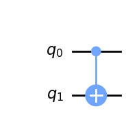

# Things learned from this module

- Qubits have a default value of 0 (at least in qiskit)
- We can invert the bit to encode a value of 1 using the `x` function (NOT gate)

## Breaking down addition

| First bit | Second bit | Sum |
| --------- | ---------- | --- |
| 0         | 0          | 00  |
| 0         | 1          | 01  |
| 1         | 0          | 01  |
| 1         | 1          | 10  |

### Left-Side

| First bit | Second bit | Sum |
| --------- | ---------- | --- |
| 0         | 0          | 0   |
| 0         | 1          | 1   |
| 1         | 0          | 1   |
| 1         | 1          | 0   |

- This is an XOR function
- In quantum, this is known as a controlled-NOT gate (CNOT, or `cx` in qiskit)

- There is an input and a target. The result of the `cx` function is then propagated onto the target; overriding its value
- The diagram below illustrates this, where `q0` is the input (or control) and `q1` is the target
- Both `q0` and `q1` are input bits, but `q1` will be overridden when the CNOT is computed

- There is a gate called Toffoli; the traditional computer equivalent is an AND gate
